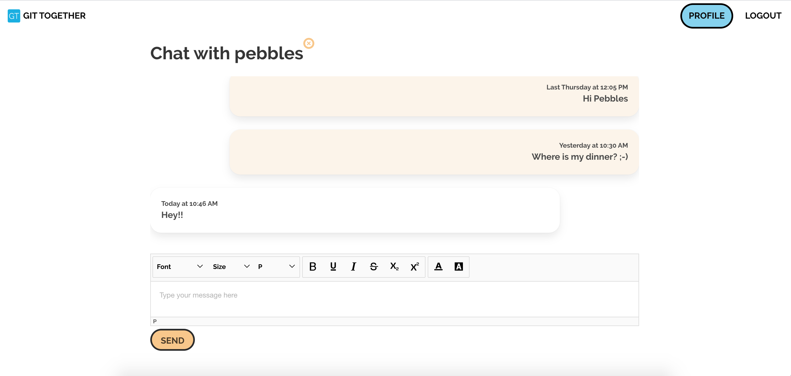

#  Project 4: Git Together

Git Together is a place where developers can support and learn from each other. Users can post and comment on questions, chat with each other and after registering they automatically get a buddy assigned to promote further communication between users. I created this website in 1 week.

## Built with
* React
* React Hooks
* Django
* Sass
* Axios
* Bulma
* Git
* GitHub

## Deployment
The website is deployed on Heroku and can be found [here](https://lets-git-together.herokuapp.com/).

## Getting started
Use the clone button to download the source code. Run the following commands in the terminal:
```
<!-- To install all the packages in the frontend directory: -->
$ yarn

<!-- To install all the packages in the root directory: -->
<!-- Install Django and a shell in the root directory -->
$ pip install pipenv
$ pipenv install django==2.2.9
$ pipenv shell

<!-- Create the postgreSQL database -->
$ pipenv install psycopg2-binary  
$ createdb codenewbies

<!-- Migrate everything from the backend -->
$ python manage.py migrate

<!-- Seed your database by running the following command -->
$ python manage.py loaddata languages/seeds.json jwt_auth/seeds.json questions/seeds.json

<!-- To run the project on localhost:8000 type: -->
$ python manage.py runserver

```

## Website architecture
The main components of the website are the home page, index page which links to the detail page of all of the individual questions, profile page and  chat page.

### 1. Home and Index page
Home:
 

Index:


The home page consists of the name of the website and a link to all the questions. Users can also register or log into their account via the navbar. If the button 'Go to all questions' is clicked, the user will be taken to the Index page. This page shows every question asked from newest to oldest. Users can change the filters to see oldest first or questions about a particular language, such as JavaScript. They can also use keywords in the search bar to look for a particular question. 

Because of the time constraint, I only wrote tests for the Index page. I used Jest, Enzyme and Sinon to do this. I for example wanted to check whether people who are not logged in, couldn't see the button to create a new question and if all of the questions are exactly rendered on the page:

``` javascript
describe('Index Page Component', () => {
  ...

it('renders a text to log in without token', () => {
      const component = shallow((<Index questions={data} />))
      expect(component.find('.no-create-btn').text()).toEqual('Log in to ask a question')
    }),


it('renders questions when there is data', () => {
      const component = shallow((<Index questions={data} />))
      component.setState({ filterQuestions: data })
      expect(component.state('filterQuestions')).toEqual(data)
    })

}
```

### 2. Detail page

 

The detail page shows the details of a question and the given answers (if any). Users can only delete their own questions and answers. The third-party text teditor 'SunEditor' makes it possible for logged in users to post questions and answers with code snippets, as well as with for example highlighted sections and different font sizes. The answers are filtered from oldest to newest, so the first answer is always at the top.

### 3. Profile page
 

The information on the profile page depends on whether the logged in user looks at their own profile or the profile of another user. If they are looking at someone else's profile page, they wouldn't see the button to change the information nor the chats section. Every user has a buddy, which automatically gets assigned to them when they log in for the first time. In the backend, I check whether there is a user who doesn't have a buddy. If this is the case, the newly registered user will become buddies with this other user. Otherwise, the new user needs to wait for someone else to register and log in. I used the following code for this functionality in Django:

``` javascript
 if user.buddy == None:
    buddies = User.objects.filter(buddy=None)
        for other_user in buddies:
            if other_user.username != user.username:
                user.buddy = other_user
                other_user.buddy = user
                other_user.save()
                user.save()
```

Users can also see their active chats. When they get a new message, they will be notified in the navbar (if they are not on their own profile page) and on their profile page in the chat section. 


The last section of the profile page consists of the titles of the questions that the user has asked on the website. These link to the detail page of that particular question so the body of the question and the answers can be viewed.

### 4. Chat page



The chat page can only be viewed by the two users who are chatting. The messages from the current user are always showing to the right with a light orange colour as the background, while the messages from the other user are alligned to the left. The text editor SunEditor is used here as well, so users can help each other in a more private setting by sending code snippets. Every time the chat updates, which happens when one of the users sends a message, the chat container scrolls down so the most recent message is at the bottom. I used the ref attribute to do this:


``` javascript
  componentDidUpdate() {
    this.scrollToBottom()
  }

  scrollToBottom = () => {
    this.messagesEnd.scrollIntoView({ block: "end" })
  }

  <section>
      ...
      <div ref={(el) => { this.messagesEnd = el; }}></div>
  </section>

```

## Wins and challenges
* Because I like a challenge (this was actually a win), I decided to rewrite the pages to React Hooks after I'd created every functionality and page. It was a lot of fun to work with something different and I managed to use Hooks for most of the pages, such as the Detail, Register and Login pages.
* In the beginning, it was difficult to write tests for React with Enzyme as I'd never done that before. I wrote tests for the Index page to practice. The tests check for example if the main container is rendered, if it shows the questions and whether the search functionality works.

## Future improvements
* The buddy functionality couples users regardless of the programming languages they picked during registration as this was quite tricky to implement in Django. I think the buddy system would be more useful when users are only buddied up if they have picked one or more of the same languages.
* The notification system only works for the chats at the moment. However, I think this should also be added to the question/answer functionality so users know when someone has answered their question.
* Another thing I want to add to the question functionality is being able to save questions. That way, users can see those saved questions on their profile page if they ever needed to see the question and its answers again.

